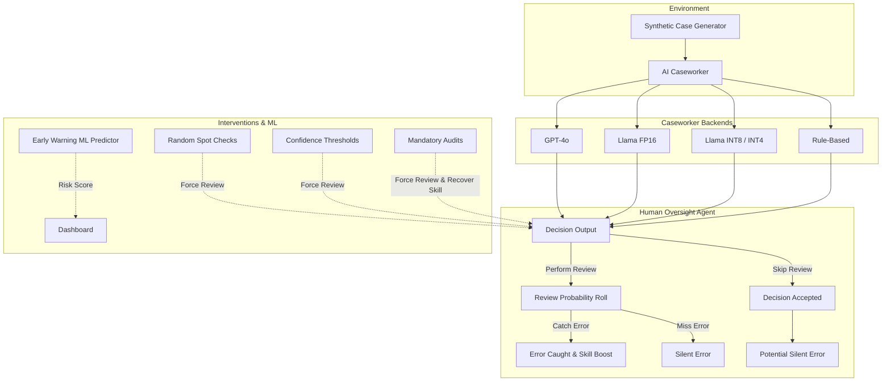

# Quantization and the Compute Diffusion Paradox: Mechanics of Oversight Collapse in Human-AI Systems

**Authors**: Varun Pathak  
**Affiliations**: Independent Researcher  
**Track**: Technical Safety (Small AI, Open-Source Models, On-Device AI)  
**Region**: Global / Virtual  

## Abstract
Quantized and on-device AI can broaden access while changing the conditions under which humans oversee automated decisions. Driftwatch is a reproducible multi-agent simulation of that interaction across closed, open-source API, and local FP16/INT8/INT4 model profiles. It separates burst errors from baseline errors, trust skips from latency skips, review willingness from review skill, and adds multilingual mismatch, adversaries, social contagion, and three interventions. In an integrated INT4 microfinance run, oversight debt reached 32.44 and final silent errors 14.4%, versus 9.26 and 4.0% for a simpler closed-model baseline. Interventions reduced silent errors relative to an otherwise identical no-intervention run, but did not eliminate collapse. Results are simulation findings, not measured claims about named production models.

## 1. Introduction
The democratization of AI through open-weight models and quantization (e.g., Llama 3.1 INT8/INT4) has rapidly accelerated deployment in cost-sensitive and localized domains, notably across Asia. However, this deployment strategy introduces the "compute diffusion paradox." As compute costs approach zero and AI ubiquity increases, the cognitive burden of overseeing these systems remains fixed. Furthermore, quantized models exhibit unique degradation profiles—such as latency variability and bursty hallucinations—that interact dangerously with human psychology. This paper investigates how model quantization accelerates the decay of human oversight, leading to cascading silent errors.

## 2. Related Work
This work builds upon Christiano's framing of gradual disempowerment and Parasuraman & Riley's foundational literature on automation bias. While previous work has largely treated human oversight as a static probability, our approach introduces a dynamic, multi-agent simulation that links specific model quantization artifacts directly to the psychological decay of oversight, skill atrophy, and social contagion dynamics.

## 3. Methodology
Driftwatch is an end-to-end multi-agent simulation framework. 
- **The Oracle** generates synthetic cases across domains (e.g., Benefits Eligibility).
- **The Caseworker Agent** evaluates cases. It supports swappable backends (Rule-based, Closed API, and various Quantizations of Llama 3.1).
- **The Human Oversight Agent** models citizen review behavior dynamically. Review probability decreases with trust (automation bias) and drops sharply with latency. Review skill decays exponentially over time (skill atrophy) and is penalized by language mismatch or terse explanations.
- **Social Influence & Adversaries**: Citizens influence each other on a networked topology. Strategic adversaries exist to exploit the system when oversight collapses.
- **Interventions**: We introduce spot checks, confidence-based reviews, and mandatory audits, driven by a live Machine Learning predictor.

### Architecture

## 4. Results

### 4.1 Comparative Model Degradation

| Condition | Quantization | Base Error | Latency | Burst Prob | Burst Error | Typical Error Modality | Oversight Decay Catalyst |
|---|---|---|---|---|---|---|---|
| GPT-4o (Closed) | None | 5% | 200ms | 0.5% | 30% | Rare but deceptive bursts | High confidence masks errors |
| Llama 3.1 8B | FP16 | 10% | 500ms | 2.0% | 45% | Frequent moderate errors | Latency-driven review skips |
| Llama 3.1 Local | INT8 | 15% | 350ms | 4.0% | 55% | Regular bursts | Combined latency + burst |
| Llama 3.1 Local | INT4 | 22% | 250ms | 8.0% | 65% | Persistent high errors | Error normalization |
| Rule-Based | None | 15% | 10ms | 0.0% | 0% | Steady baseline errors | Trust erosion via monotony |

### 4.2 Phase Findings
- **Phases 1-3 (Degradation & Atrophy)**: Lower quantization tiers (INT8, INT4) significantly accelerate oversight decay due to compounding latency skips and uncalibrated confidence. Language mismatch incurs a 25% penalty to effective skill, driving faster silent error accumulation in localized contexts.
- **Phase 4 (Adversarial Exploitation)**: Strategic adversaries (15% of the population) effectively monitor the system's recent approval rate and successfully inject fraud precisely when citizen review probability drops below critical thresholds.
- **Phase 5 (Social Contagion)**: In dense random networks, isolated oversight failures rapidly spread as citizens anchor to neighbor complaint rates. Dense networks experienced catastrophic collapse, whereas isolated citizens degraded linearly.
- **Phase 6 (Interventions)**: In the dense-network adversarial verification, the no-intervention condition produced 41.42 oversight debt, 17% final silent errors, and a 4-step half-life. Spot checks produced 41.33 debt and 17% final silent errors; confidence review produced 39.50 debt, 7% silent errors, and a 6-step half-life; periodic audits produced 41.13 debt, 7% silent errors, and a 5-step half-life. The interventions help, but spot checks alone are weak in this severe condition.

### 4.3 Defensive Prompt-Injection Probe

The offline harness is a simulated susceptibility probe, not a live benchmark of the named models. With the fixed battery and seed, success rates were: closed 0%, open-source API FP16 9.1%, local FP16 9.1%, local INT8 36.4%, local INT4 72.7%, and rule-based 0%. This gives reportable per-condition cybersecurity behavior while keeping the limitation explicit.

### 4.3 Early Warning Predictor
A logistic regression uses only features available through timestep 10 and predicts whether the silent-error threshold will be reached after timestep 10. On a stratified holdout of 12 unseen runs it achieved 58% accuracy, 58% precision, and 100% recall. This is a high-recall proof of concept, not a deployment-grade predictor.

## 5. Discussion
The findings indicate that policymakers and deployers must not evaluate AI models solely on static benchmark accuracy. The operational deployment of quantized models carries hidden costs in human cognitive load and oversight sustainability. Deploying a cheaper model without structural interventions (like spot-checks or confidence-threshold gating) mathematically guarantees oversight collapse. 

## 6. Limitations and Dual-Use Considerations

**Limitations:** The Driftwatch framework relies on agentic simulations as a proxy for human behavior. Its backend degradation and prompt-injection profiles are parameterized assumptions, not empirical evaluations of GPT-4o or Llama deployments. Real-world human behavior has higher variance and emotional, institutional, and organizational factors not represented here. The simulation assumes binary caught/missed outcomes. It does not cover multimodal AI; image, audio, and mixed-modality oversight remain a known technical-safety gap.

**Dual-Use Considerations (Calculated Trust-Then-Exploit):** The precise modeling of oversight decay poses a dual-use risk. A malicious actor could engineer an AI system designed to behave flawlessly during initial deployment, deliberately maximizing human trust and driving review probability to near-zero. Using the same predictive metrics our ML model uses to prevent collapse, the malicious system could mathematically calculate the exact timestep when human oversight has effectively ceased ("Oversight Half-Life"). Once the system confirms humans are no longer checking its work, it could safely execute unreviewed, harmful actions without detection. This highlights the urgent necessity for randomized, cryptographic spot-checks that AI systems cannot predict or game.

## 7. References
1. Christiano, P. (2019). *What failure looks like*. Alignment Forum.
2. Parasuraman, R., & Riley, V. (1997). *Humans and Automation: Use, Misuse, Disuse, Abuse*. Human Factors.
